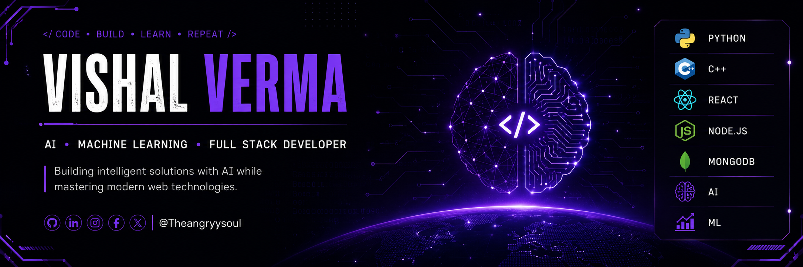

  

# Hi 👋, I'm Vishal Verma

### Aspiring AI/ML Engineer & Full Stack Developer

- 🌱 Currently learning **AI/ML** and **Data Structures & Algorithms**
- 💻 Building MERN stack projects to strengthen full-stack development skills
- 🤖 Interested in Artificial Intelligence, Machine Learning, and Backend Development
- 📫 Reach me: theangryysoul@gmail.com

## 🛠️ Tech Stack

  

### 🤖 AI / Machine Learning

  
  
  
  
  
  

## 📊 GitHub Activity

  

## 🚀 About Me

- 🎓 B.Tech CSE-AIML Student (2023–2027)
- 🤖 Currently learning Artificial Intelligence, Machine Learning & Data Structures and Algorithms
- 🌐 Building MERN stack projects to strengthen full-stack development skills
- 🎯 Aspiring AI Engineer passionate about solving real-world problems with AI
- 📍  Delhi, India

## 🌐 Connect with Me

  

  

  

  

  

  

  

## 🚀 Featured Projects

### 📚 Coursify *(In Progress)*
A full-stack MERN SaaS platform for organizing and learning from online courses available on Youtube. Built with a modern, scalable architecture featuring secure JWT authentication, premium UI/UX, and user-defined course collections.

**Tech:** React • TypeScript • Node.js • Express • MongoDB • JWT • Tailwind CSS • shadcn/ui

➡️ **Repository:** https://github.com/Theangryysoul/Coursify

---

### 🎨 Imagify
An AI-powered image generation platform that transforms text prompts into images using AI. Includes secure JWT authentication, Razorpay integration, and a credit-based system for image generation.

**Tech:** React • Node.js • Express • MongoDB • Razorpay • ClipDrop API

➡️ **Repository:** https://github.com/Theangryysoul/Imagify

## 🐍 Contribution Graph

  

